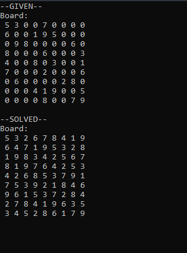

# sudokuSolver
Solves a Sudoku Puzzle!

Uses a backtracking algorithm to solve a given Sudoku board.

create a text file with 9 rows, each row containing 9 cells to test. Or use the given sample txt file.

**Example Output:**

see wiki for rules and insights:

https://en.wikipedia.org/wiki/Sudoku
